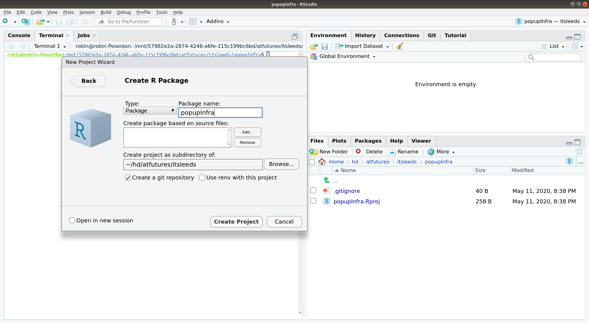

<!-- README.md is generated from README.Rmd. Please edit that file -->

# popupInfra

<!-- badges: start -->

<!-- badges: end -->

The goal of popupInfra is to demonstrate how to find roads with ‘spare
lanes’.

The package was created in RStudio by clicking File \> New Project and
completing the form as follows:



The code used to find how many lanes for motor traffic there are on
roads in Santiago can be found in the file `code/santiago.R`.

``` r
dir.create("code")
file.edit("code/santiago.R")
```
